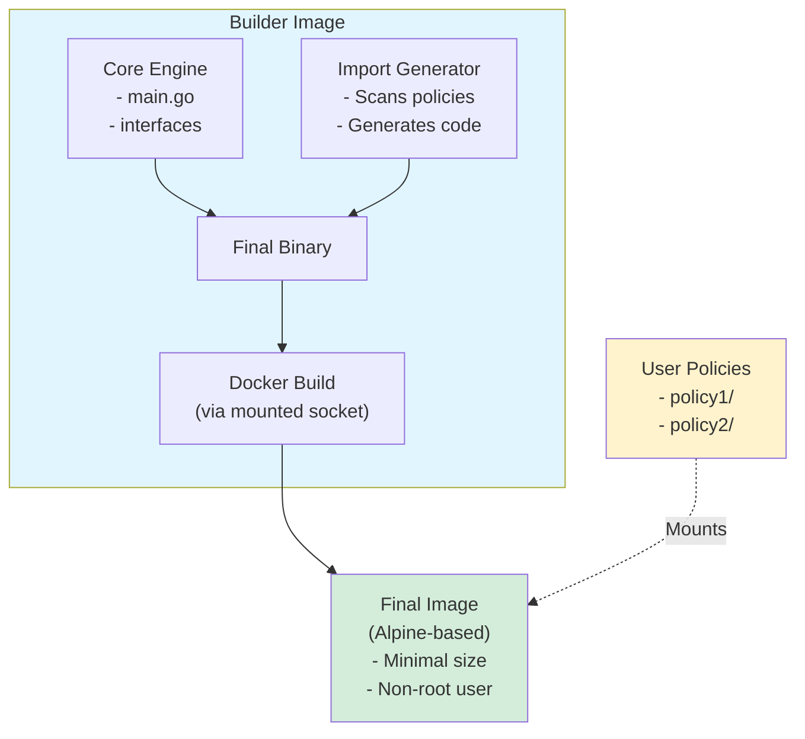

# Policy Engine - Go Plugin System with Docker

A flexible, plugin-based policy engine built with Go that allows users to implement custom policies as separate Go modules. The system uses Docker to dynamically build and compile policies into a single executable.

## Features

✅ **Dynamic Discovery** - Automatically finds and registers policies from mounted directories
✅ **Type-Safe** - Full compile-time type checking with Go interfaces
✅ **Zero Runtime Overhead** - All policies compiled into single static binary
✅ **Docker-Based** - Consistent build environment, works anywhere
✅ **Simple Interface** - Just 3 methods to implement: `Name()`, `Execute()`, `Validate()`
✅ **Modular** - Policies are independent Go modules with their own dependencies
✅ **Production Ready** - Tested, documented, and easy to deploy

## Architecture Overview



## Components

### 1. Core Engine (`core/`)
- **interfaces.go**: Defines the `Policy` interface and registry system
- **main.go**: Core runtime that executes registered policies
- **imports.go**: Auto-generated file containing policy imports

### 2. Import Generator (`import-generator/`)
- Scans mounted policy directories
- Discovers policy modules via `go.mod` files
- Generates import statements and registration code
- Outputs to `core/imports.go`

### 3. Build System
- **Dockerfile**: Single-stage builder image containing core and import generator
- **build.sh**: Orchestrates the build process and creates final Alpine image
- **Docker-in-Docker**: Uses mounted Docker socket to build final image

## Policy Interface

All policies must implement this interface:

```go
type Policy interface {
    // Name returns the unique identifier for this policy
    Name() string

    // Execute runs the policy logic with the given input
    Execute(ctx context.Context, input interface{}) (interface{}, error)

    // Validate checks if the policy configuration is valid
    Validate() error
}
```

## Quick Start

### Quick Test (Using Makefile)

The easiest way to get started:

```bash
make test
```

This will build the image and run it with the example policies.

**Other useful commands:**
- `make build` - Build the Docker image
- `make run` - Run with example policies
- `make show-imports` - View the auto-generated imports
- `make help` - Show all available commands

### Step 1: Build the Builder Image

```bash
docker build -t policy-builder:latest .
```

### Step 2: Create Your Policies

Create a directory structure like this:

```
my-policies/
├── policy1/
│   ├── go.mod
│   └── policy.go
└── policy2/
    ├── go.mod
    └── policy.go
```

**Example Policy** (`my-policies/example/policy.go`):

```go
package example

import (
    "context"
)

type Policy struct{}

func (p *Policy) Name() string {
    return "example-policy"
}

func (p *Policy) Execute(ctx context.Context, input interface{}) (interface{}, error) {
    return map[string]interface{}{
        "policy": p.Name(),
        "result": "success",
        "input": input,
    }, nil
}

func (p *Policy) Validate() error {
    return nil
}
```

**go.mod** (`my-policies/example/go.mod`):

```go
module github.com/yourorg/policies/example

go 1.21
```

### Step 3: Build Final Docker Image

```bash
# Build the final Alpine-based Docker image with your policies
docker run --rm \
  -v $(pwd)/my-policies:/policies \
  -v /var/run/docker.sock:/var/run/docker.sock \
  -e POLICY_ENGINE_IMAGE_REPO=my-policy-app \
  -e POLICY_ENGINE_TAG=v1.0.0 \
  policy-builder:latest

# This will create a final image: my-policy-app:v1.0.0
# The image is Alpine-based and minimal in size

# Run the final image
docker run my-policy-app:v1.0.0

# Save the final image to a tar file
docker save my-policy-app:v1.0.0 -o my-policy-app.tar
```

**Environment Variables:**
- `POLICY_ENGINE_IMAGE_REPO`: Name for the final Docker image (default: `policy-engine`)
- `POLICY_ENGINE_TAG`: Tag for the final Docker image (default: `latest`)

### Alternative: Run Without Creating Final Image

If you don't mount the Docker socket, the build script will just build the binary:

```bash
# Build only (no Docker socket mounted)
docker run --rm \
  -v $(pwd)/my-policies:/policies \
  -v $(pwd)/output:/app/core \
  policy-builder:latest

# Binary is now at ./output/policy-engine
./output/policy-engine
```

## Example Policies

This repository includes two example policies:

### 1. Uppercase Policy

Converts all string values to uppercase.

```bash
docker run --rm \
  -v $(pwd)/example-policies:/policies \
  policy-builder:latest run
```

### 2. Validator Policy

Validates that required fields are present in the input.

### Example Output

When you run the example policies, you'll see output like this:

```
=========================================
Policy Engine Build Process
=========================================

Step 1: Running import generator...
  - Downloading import generator dependencies...
  - Scanning policies in /policies...
  ✓ Import generation complete

Step 2: Resolving dependencies...
  - Adding policy modules to go.mod...
    Adding: github.com/example/policies/uppercase-policy -> /policies/uppercase-policy/
    Adding: github.com/example/policies/validator-policy -> /policies/validator-policy/
  - Running go mod tidy...
  ✓ Dependencies resolved

Step 3: Building application...
  - Compiling Go binary...
  ✓ Build complete

=========================================
Build Summary
=========================================
Binary: /app/core/policy-engine
Size: 2.2M

Executing policy engine...
Policy Engine Starting...
Loaded 2 policies: [uppercase-policy validator-policy]

Executing policies...

--- Executing policy: uppercase-policy ---
Result: {
  "action": "uppercase transformation",
  "input": {...},
  "output": {
    "message": "HELLO FROM POLICY ENGINE",
    "data": ["ITEM1", "ITEM2", "ITEM3"]
  },
  "policy": "uppercase-policy"
}

--- Executing policy: validator-policy ---
Result: {
  "action": "field validation",
  "status": "PASSED",
  "message": "All required fields present"
}

Policy Engine Completed Successfully
```

## Development Workflow

### Testing Your Policies Locally

1. **Create your policy module:**
   ```bash
   mkdir -p my-policies/my-policy
   cd my-policies/my-policy
   go mod init github.com/yourorg/policies/my-policy
   ```

2. **Implement the policy:**
   Create `policy.go` with a struct that implements the `Policy` interface.

3. **Test with the builder:**
   ```bash
   docker run --rm \
     -v $(pwd)/my-policies:/policies \
     policy-builder:latest run
   ```

### Policy Naming Convention

For automatic discovery, name your main policy file `policy.go` and your main type `Policy`. The import generator looks for this convention.

## Advanced Usage

### Custom Build Output

```bash
# Build without running
docker run --rm \
  -v $(pwd)/my-policies:/policies \
  -v $(pwd)/output:/app/core \
  policy-builder:latest

# Binary is now at ./output/policy-engine
./output/policy-engine
```

### Debugging

View the generated imports file:

```bash
docker run --rm \
  -v $(pwd)/my-policies:/policies \
  policy-builder:latest sh -c "/build.sh && cat /app/core/imports.go"
```

### Multiple Policy Directories

Mount multiple policy directories:

```bash
docker run --rm \
  -v $(pwd)/policies-team-a:/policies \
  -v $(pwd)/policies-team-b:/policies-extra \
  policy-builder:latest
```

Note: You'll need to modify the import generator to scan multiple directories.

## Project Structure

```
.
├── core/
│   ├── go.mod              # Core module definition
│   ├── interfaces.go       # Policy interface
│   ├── main.go             # Core runtime
│   └── imports.go          # Auto-generated imports
│
├── import-generator/
│   ├── go.mod              # Generator module
│   └── main.go             # Import generation logic
│
├── example-policies/
│   ├── uppercase-policy/   # Example policy 1
│   │   ├── go.mod
│   │   └── policy.go
│   └── validator-policy/   # Example policy 2
│       ├── go.mod
│       └── policy.go
│
├── Dockerfile              # Builder image definition
├── build.sh                # Build orchestration script
├── plan.md                 # Detailed design document
└── README.md               # This file
```

## How It Works

1. **User mounts policies** to `/policies` directory and Docker socket to `/var/run/docker.sock`
2. **Import generator scans** the directory for Go modules
3. **Generator creates** `imports.go` with:
   - Import statements for each policy module
   - Registration calls in `init()` function
4. **Build script** runs:
   - Adds policy modules as dependencies via `go mod edit -replace`
   - Runs `go mod tidy` to resolve dependencies
   - Compiles the final binary with static linking
5. **Docker image creation**:
   - Creates temporary Dockerfile for Alpine-based image
   - Copies binary to build context
   - Builds final minimal Docker image
   - Cleans up temporary files
6. **Final image** is ready to run with all policies compiled in

## Benefits

- **Type-safe**: Full compile-time type checking
- **Performance**: No runtime plugin loading overhead
- **Cross-platform**: Works on any platform Go supports
- **Simple deployment**: Single static binary or minimal Docker image
- **Version control**: Each policy is a versioned Go module
- **Minimal footprint**: Final Alpine image is small and secure
- **Production-ready**: Final image runs as non-root user
- **Portable**: Final image can be saved and distributed easily

## Troubleshooting

### Policy Not Discovered

Ensure your policy directory has:
- A `go.mod` file with valid module path
- A `policy.go` file with a type named `Policy`
- The type implements all `Policy` interface methods

### Build Failures

Check that:
- All policy imports are accessible
- No circular dependencies exist
- Go versions are compatible (1.21+)

### Import Errors

View generated imports:
```bash
docker run --rm \
  -v $(pwd)/my-policies:/policies \
  policy-builder:latest sh -c "/build.sh && cat /app/core/imports.go"
```

### Docker Socket Issues

If you see "Docker socket not mounted" warning:
- Make sure you're mounting the Docker socket: `-v /var/run/docker.sock:/var/run/docker.sock`
- Check Docker socket permissions: `ls -la /var/run/docker.sock`
- On some systems you may need to run with appropriate permissions

Without Docker socket, the builder will still create the binary but won't build the final Docker image.

### Final Image Not Created

If the final Docker image isn't being created:
1. Verify Docker socket is mounted
2. Check Docker daemon is running: `docker ps`
3. Verify you have permission to access Docker socket
4. Check for Docker CLI installation errors in build output

## Performance Considerations

- **Build time**: Increases with number of policies
- **Binary size**: Grows with each policy
- **Runtime**: Minimal overhead, all policies are natively compiled

## Security Considerations

- Policies run with full application permissions
- No sandboxing between policies
- Validate policy source before building
- Consider code review for all policies

## Extending the System

### Adding Policy Configuration

Modify the `Policy` interface to include configuration:

```go
type Policy interface {
    Name() string
    Execute(ctx context.Context, input interface{}) (interface{}, error)
    Validate() error
    Configure(config interface{}) error
}
```

### Adding Metrics

Wrap policy execution with metrics:

```go
func (r *PolicyRegistry) ExecuteWithMetrics(name string, ctx context.Context, input interface{}) {
    start := time.Now()
    defer func() {
        duration := time.Since(start)
        log.Printf("Policy %s took %v", name, duration)
    }()
    // Execute policy
}
```

## Future Enhancements

- [ ] Hot-reload capabilities
- [ ] Policy dependency resolution
- [ ] Web UI for policy management
- [ ] Policy marketplace/registry
- [ ] Multi-architecture builds
- [ ] Policy testing framework
- [ ] Metrics and monitoring
- [ ] Policy versioning support

## Contributing

1. Create your policy in `example-policies/`
2. Test with the builder image
3. Submit a pull request

## License

MIT

## Support

For issues and questions, please open a GitHub issue.
