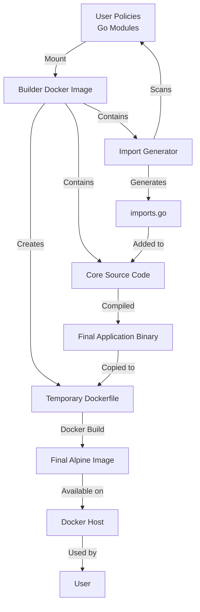
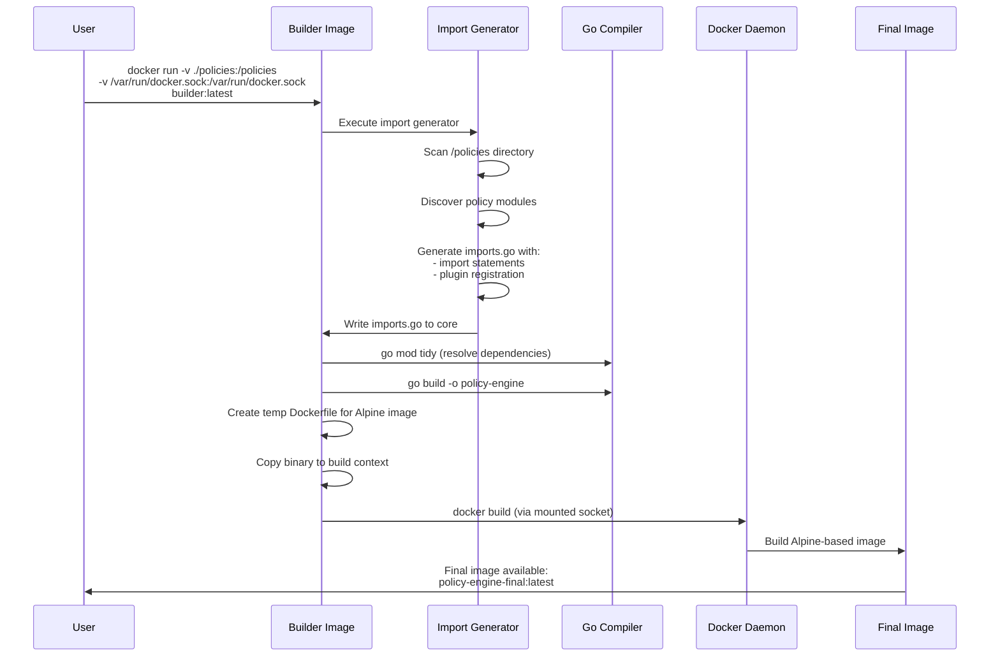
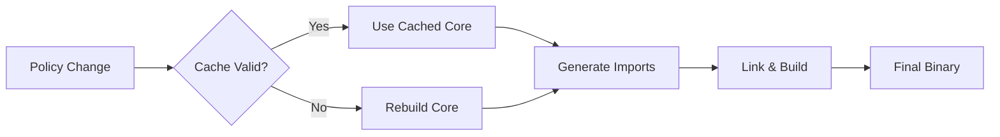

# Go Plugin-Based Application with Docker Build System

## Overview

This document outlines the architecture and implementation plan for a Go application that uses a plugin-based architecture with policies. The system uses a Docker-in-Docker approach where users mount their custom policies, and a builder image generates and compiles the final application.

## Architecture Components

### 1. Core Application
- Go module with `main.go`
- Defines interfaces for policy plugins
- Provides runtime execution framework
- Runs in Alpine Linux container

### 2. Policy Plugins
- User-implemented Go modules
- Each has its own `go.mod`
- Implements core interfaces
- Mounted at runtime to builder image

### 3. Import Generator
- Separate main function in core
- Scans mounted policy directory
- Generates Go import statements
- Creates dynamic plugin registration code

### 4. Builder Docker Image
- Contains core source code
- Contains import generator source
- Accepts policy mounts
- Builds final application image

## System Flow



## Detailed Workflow



## Directory Structure

```
builder-image/
├── core/
│   ├── go.mod
│   ├── main.go              # Core application entry point
│   ├── interfaces.go        # Policy interface definitions
│   ├── runtime.go           # Plugin execution runtime
│   └── imports.go           # Generated by import-generator
│
├── import-generator/
│   ├── main.go              # Import generator tool
│   └── go.mod
│
└── Dockerfile               # Single Dockerfile for builder image

user-policies/
├── policy1/
│   ├── go.mod
│   └── policy.go            # Implements core interface
│
└── policy2/
    ├── go.mod
    └── policy.go            # Implements core interface
```

## Implementation Plan

### Phase 1: Core Application Setup

#### 1.1 Define Policy Interface
```go
// core/interfaces.go
package main

type Policy interface {
    Name() string
    Execute(ctx context.Context, input interface{}) (interface{}, error)
    Validate() error
}
```

#### 1.2 Create Core Runtime
```go
// core/main.go
package main

var policies []Policy

func RegisterPolicy(p Policy) {
    policies = append(policies, p)
}

func main() {
    // Runtime logic to execute policies
}
```

### Phase 2: Import Generator

#### 2.1 Policy Discovery
- Scan mounted directory (`/policies`)
- Parse `go.mod` files to identify modules
- Find policy implementations (files implementing Policy interface)

#### 2.2 Code Generation
Generate `imports.go`:
```go
package main

import (
    policy1 "github.com/user/policy1"
    policy2 "github.com/user/policy2"
)

func init() {
    RegisterPolicy(&policy1.MyPolicy{})
    RegisterPolicy(&policy2.MyPolicy{})
}
```

### Phase 3: Dockerfile Implementation

```dockerfile
# Single-stage Dockerfile for Builder Image
# This image contains the core and import generator
# It uses Docker-in-Docker to create the final Alpine-based image

FROM golang:1.21-alpine

# Install build dependencies
RUN apk add --no-cache git

# Create working directory
WORKDIR /app

# Copy core application source
COPY core/ /app/core/

# Copy import generator source
COPY import-generator/ /app/import-generator/

# Pre-download import generator dependencies
WORKDIR /app/import-generator
RUN go mod download && go mod verify

# Copy and prepare build script
WORKDIR /app
COPY build.sh /build.sh
RUN chmod +x /build.sh

# The build script will:
# 1. Run import generator to scan /policies (mounted by user)
# 2. Generate imports.go with policy registrations
# 3. Build the final application binary
# 4. Install Docker CLI
# 5. Create a temporary Dockerfile for final Alpine image
# 6. Build the final Docker image using Docker-in-Docker
# 7. Output the final image name

ENTRYPOINT ["/build.sh"]
```

**Key Changes:**
- Single-stage builder image (not multi-stage)
- Docker-in-Docker approach: requires `/var/run/docker.sock` mount
- Build script dynamically creates final Dockerfile
- Final image is Alpine-based with minimal footprint
- Supports custom image name/tag via environment variables

### Phase 4: Build Script

```bash
#!/bin/sh
# build.sh - Orchestrates the build process

set -e

echo "Step 1: Running import generator..."
cd /app/import-generator
go run main.go -policies=/policies -output=/app/core/imports.go

echo "Step 2: Resolving dependencies..."
cd /app/core
# Add policy modules as replace directives
for policy_dir in /policies/*/; do
    if [ -f "${policy_dir}go.mod" ]; then
        module_path=$(grep "^module " "${policy_dir}go.mod" | awk '{print $2}')
        go mod edit -replace="$module_path=$policy_dir"
    fi
done
go mod tidy

echo "Step 3: Building application..."
CGO_ENABLED=0 GOOS=linux go build -a -installsuffix cgo -o policy-engine .

echo "Step 4: Creating final Docker image..."
# Install Docker CLI
apk add --no-cache docker-cli

# Create temporary build context
BUILD_CONTEXT="/tmp/final-image-build"
mkdir -p "$BUILD_CONTEXT"
cp /app/core/policy-engine "$BUILD_CONTEXT/"

# Generate Dockerfile for final image
cat > "$BUILD_CONTEXT/Dockerfile" << 'EOF'
FROM alpine:latest
RUN apk --no-cache add ca-certificates
RUN addgroup -g 1000 appuser && adduser -D -u 1000 -G appuser appuser
WORKDIR /app
COPY policy-engine /app/policy-engine
RUN chmod +x /app/policy-engine
USER appuser
ENTRYPOINT ["/app/policy-engine"]
EOF

# Build final image
docker build -t ${POLICY_ENGINE_IMAGE_REPO:-policy-engine}:${POLICY_ENGINE_TAG:-latest} "$BUILD_CONTEXT"
rm -rf "$BUILD_CONTEXT"

echo "Build complete!"
```

## Usage Workflow

### For Users

1. **Prepare Policies**
   ```bash
   mkdir my-policies
   cd my-policies
   # Create policy modules
   ```

2. **Run Builder Image**
   ```bash
   docker run -v $(pwd)/my-policies:/policies \
              -v /var/run/docker.sock:/var/run/docker.sock \
              -e POLICY_ENGINE_IMAGE_REPO=my-policy-app \
              -e POLICY_ENGINE_TAG=v1.0.0 \
              builder:latest
   ```

3. **Get Final Image**
   - Builder creates `my-policy-app:v1.0.0` (or `policy-engine:latest` by default)
   - Run with: `docker run my-policy-app:v1.0.0`
   - Save with: `docker save my-policy-app:v1.0.0 -o my-app.tar`

### Environment Variables

- `POLICY_ENGINE_IMAGE_REPO`: Name for the final Docker image (default: `policy-engine`)
- `POLICY_ENGINE_TAG`: Tag for the final Docker image (default: `latest`)

## Technical Considerations

### 1. Dependency Management
- Core `go.mod` should be minimal
- Import generator must handle version conflicts
- Use `go mod tidy` to resolve transitive dependencies
- Policy modules added via `go mod edit -replace` directives

### 2. Build Performance
- Layer caching for core dependencies
- Only rebuild when policies change
- Consider using Go build cache
- Docker layer caching for final image builds

### 3. Docker-in-Docker Approach
- **Requirement**: Docker socket must be mounted (`/var/run/docker.sock`)
- **Benefits**:
  - Final image is minimal (Alpine-based)
  - Separation between builder and runtime
  - Users get a ready-to-run image
- **Security**: Builder image has access to Docker daemon
  - Consider running in isolated environment
  - Use Docker socket with appropriate permissions
- **Image Customization**:
  - Set `POLICY_ENGINE_IMAGE_REPO` env var for custom name
  - Set `POLICY_ENGINE_TAG` env var for custom tag

### 4. Security
- Validate policy code before building
- Scan for malicious imports
- Consider sandboxing policy execution
- Run final image as non-root user (appuser)
- Docker socket access requires careful permission management

### 5. Error Handling
- Import generator should validate:
  - Policy implements correct interface
  - No circular dependencies
  - Valid Go module structure
- Graceful fallback if Docker socket not mounted
- Provide clear error messages
- Build script exits cleanly on failures

## Alternative Approaches Considered

### Option 1: Plugin System with `plugin` package
**Pros:** Dynamic loading without recompilation
**Cons:** Linux-only, same Go version required, fragile

### Option 2: WebAssembly Plugins
**Pros:** Language-agnostic, sandboxed
**Cons:** Performance overhead, limited Go stdlib support

### Option 3: Code Generation (Chosen)
**Pros:** Type-safe, best performance, cross-platform
**Cons:** Requires recompilation, longer build time

## Build Optimization Strategies



## Testing Strategy

### Unit Tests
- Test policy interface implementations
- Test import generator logic
- Test core runtime

### Integration Tests
- Mount sample policies
- Run full build process
- Verify final image

### Example Test Policy
```go
// test-policy/policy.go
package testpolicy

type TestPolicy struct{}

func (p *TestPolicy) Name() string {
    return "test-policy"
}

func (p *TestPolicy) Execute(ctx context.Context, input interface{}) (interface{}, error) {
    return "success", nil
}

func (p *TestPolicy) Validate() error {
    return nil
}
```

## Deployment

### Publishing Builder Image
```bash
docker build -t myorg/policy-builder:latest .
docker push myorg/policy-builder:latest
```

### User Documentation
Provide clear examples:
- Policy interface contract
- Module structure requirements
- Build and run commands
- Troubleshooting guide

## Future Enhancements

1. **Hot Reload**: Rebuild on policy file changes
2. **Policy Versioning**: Support multiple policy versions
3. **Registry Integration**: Pull policies from remote registry
4. **Web UI**: Visual policy management
5. **Metrics**: Build time and runtime performance metrics
6. **Multi-arch**: Support ARM and x86 architectures

## Conclusion

This architecture provides a flexible, type-safe plugin system using Go's native compilation. The single Dockerfile approach simplifies distribution while the import generator provides dynamic policy loading capabilities.
